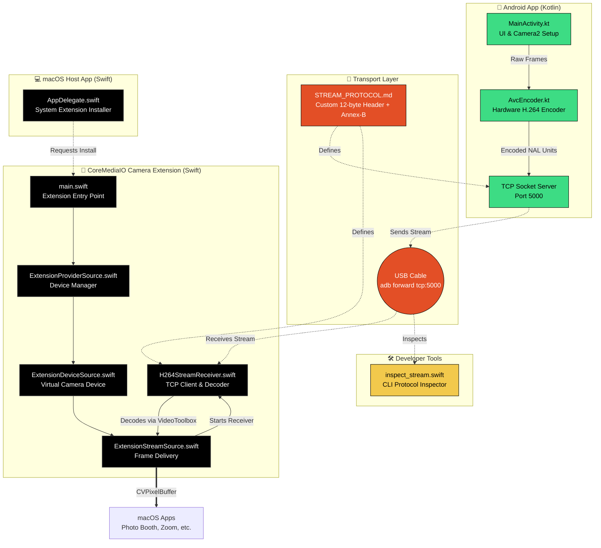

# 🧩 Lumen Codebase Architecture Graph

This document serves as a high-level map of the Lumen codebase. It visually maps how the different components in the repository communicate and interact with one another, designed to help new contributors understand the flow of data from the Android camera all the way to the macOS virtual camera.

## 🏗️ System Component Graph

## 📁 Directory Breakdown

### `android/`
Contains the standard Gradle-based Android project.
- **`MainActivity.kt`**: Handles permissions, camera preview, and starts the capture session using Android's Camera2 API.
- **`AvcEncoder.kt`**: Takes the raw camera frames and hardware-encodes them into H.264 Annex-B format using `MediaCodec`, then serves them over a raw TCP socket.

### `CameraExtension/`
The CoreMediaIO System Extension that acts as the virtual camera driver on macOS.
- **`H264StreamReceiver.swift`**: The TCP client. It connects to the Android phone (via `adb forward`), parses the `STREAM_PROTOCOL.md` headers, extracts the H.264 NAL units, and decodes them natively using `VTDecompressionSession`.
- **`ExtensionStreamSource.swift`**: Receives decoded `CVPixelBuffer` frames from the receiver and pushes them to macOS when available.

### `MacApp/`
The standard macOS `.app` bundle used to install the extension.
- **`AppDelegate.swift`**: Provides the UI and uses `OSSystemExtensionRequest` to ask macOS to install the Camera Extension.

### `STREAM_PROTOCOL.md`
The source of truth for the raw TCP stream format. Defines the 12-byte configuration header and the framing structure for the H.264 video payload.

### `tools/`
- **`inspect_stream.swift`**: A standalone Swift script used to connect to the phone's TCP socket and dump the stream configuration and frame metadata to the terminal, useful for debugging the Android encoder without needing to load the full macOS extension.
