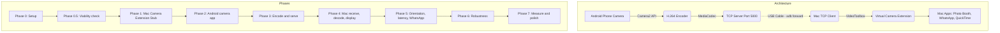

# Project Graph

```mermaid
flowchart TD
    subgraph Architecture
        A[Android Phone Camera] -->|Camera2 API| B(H.264 Encoder)
        B -->|MediaCodec| C(TCP Server Port 5000)
        C -.->|USB Cable - adb forward| D(Mac TCP Client)
        D -->|VideoToolbox| E(Virtual Camera Extension)
        E --> F[Mac Apps: Photo Booth, WhatsApp, QuickTime]
    end

    subgraph Phases
        P0[Phase 0: Setup] --> P05[Phase 0.5: Viability check]
        P05 --> P1[Phase 1: Mac Camera Extension Stub]
        P1 --> P2[Phase 2: Android camera app]
        P2 --> P3[Phase 3: Encode and serve]
        P3 --> P4[Phase 4: Mac receive, decode, display]
        P4 --> P5[Phase 5: Orientation, latency, WhatsApp]
        P5 --> P6[Phase 6: Robustness]
        P6 --> P7[Phase 7: Measure and polish]
    end
```
